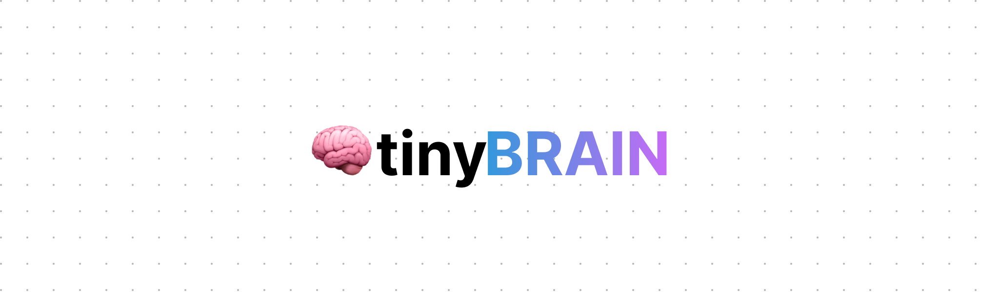

<p align="center">

</p>

> A tiny zero-dependency autograd tensor library with PyTorch like syntax, written from scratch in TypeScript

[](https://github.com/skoshx/tinybrain/blob/main/LICENSE.md)
[](https://github.com/skoshx/tinybrain/actions/workflows/ci.yml)
[](https://github.com/prettier/prettier)
[](https://github.com/skoshx/tinybrain/blob/main/README.md)

This library is a tiny zero-dependency autograd tensor library written from scratch in TypeScript, to learn in depth how everything works and to build intuition. My goal with this project is just to be able to train & run inference on a simple naive MNIST model. I might add convolutions later, if I have time.

## Features

- ~~Inference & training~~
- ~~Optimizers (SGD, more coming…)~~
- ~~Runs simple MNIST~~

## Usage

```typescript
import { Tensor } from 'tinybrain';

const x = Tensor.arange(6).reshape(2, 3);
const y = Tensor.uniform(2, 3);
const z = y.mul(x).sum();
z.backward();

console.log(x.grad); // dz/dx
console.log(y.grad); // dz/dy
```

## License

`tinybrain` is released under the [MIT License](https://opensource.org/licenses/MIT).

## TODO

- https://learn.microsoft.com/en-us/windows/ai/directml/dml-strides
- https://zhang-yang.medium.com/explain-pytorch-tensor-stride-and-tensor-storage-with-code-examples-50e637f1076d
- https://ajcr.net/stride-guide-part-1/
- https://cnugteren.github.io/tutorial/pages/page2.html
- Basic "DataLoader"
- Training code
- Adam, RMSprop optimizers?
